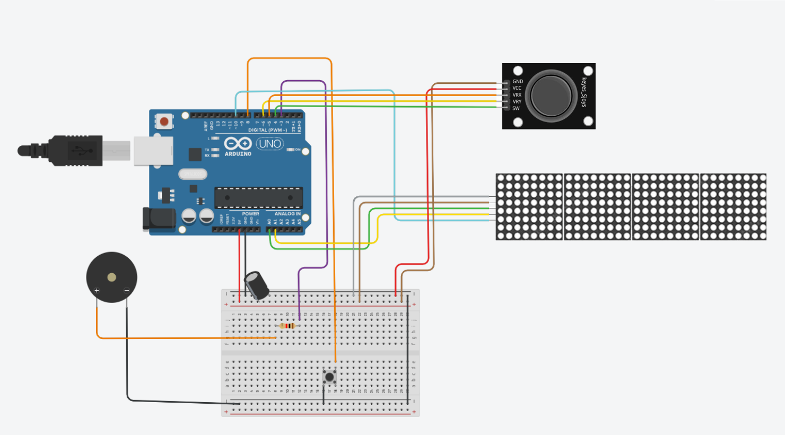

## Shooting Game using MAX7219 Dot LED Matrix

### Description
A simple Arduino-based shooting game using the MAX7219 LED matrix. This project helps in learning how to control the LED matrix, handle multiple simultaneous animations, and manage user input with a joystick.

### Video
[youtube](https://youtube.com/shorts/3P3fnXWZfwY)

### Components Required
- Arduino
- Breadboard
- MAX7219 Dot Matrix Module (x4)
- Joystick (with a button)
- Passive buzzer (optional)
- 100Ω resistor
- 100µF Capacitor
- Jumper wires

### Installation & Setup
1. Install the required Arduino libraries: `MD_MAX72xx.h` and `SPI.h`.
2. Upload the provided code to your Arduino board.
3. Connect the components as follows:

#### Joystick
- GND -> GND
- 5V -> 5V
- VRx -> A0 (for horizontal movement)
- VRy -> A1 (optional for vertical movement, not used in this project)
- SW -> PIN 10 (button)

#### MAX7219
- VCC -> 5V
- GND -> GND
- DOUT -> 51
- CS -> 6
- CLK -> 52

#### Reset Button
- Pin 8

#### Buzzer
- Pin 3

### Game Instructions
- The objective is to destroy the enemy base by shooting at it.
- Use the joystick to move the spaceship and the button to shoot.
- To restart the game, press the reset button.

### Lessons Learned
- **MAX7219 LED Matrix Control** – Explored how to interface with the matrix and update animations efficiently.  
- **Joystick Input Handling** – Processed analog input to control movement.  
- **Simultaneous Animation Management** – Updated multiple elements on the display without flickering or performance issues.  

### Notes
This was just a fun learning project, not about fine-tuning the code. I just wanted to do something more interesting with the MAX7219 matrix than just scrolling text.

### Code
``` C++
#include <MD_MAX72xx.h>
#include <SPI.h>

#define HARDWARE_TYPE MD_MAX72XX::FC16_HW
#define MAX_DEVICES 4
#define CS_PIN 6
#define SW_PIN 10
#define VRX_PIN  A1
#define VRY_PIN  A0 
#define BUZZER 3
#define BTN_RESET_PIN 8

#define ENEMY_BASE_COLUMN 31

// X value joystick
int xValue = 0; 

// button joystick
int stableButtonState = 0;
int lastButtonState = 0;
int currentButtonState = 0;
long lastDebounceBtnTime = 0;
long debounceBtnDelay = 50;

//reset button 
int btnResetState = 0;

//enemy shooting config
long lastTimeEnemyShooted = 500; // add some delay at the beginning
long lastDelayEnemyShoot = 0;
long revivalEnemyTimeout = 0; 
bool enemyShoots = false; 
int enemyShooterRow = -1;
int currentEnemyBulletCol = 20;
int currentEnemyBulletRow = 0;

// enemy config
bool enemyAlive = true; 
long lastEnemyShip = 0; // when it appeared last time
int enemyDir = 1; // which direction it moves
int enemyRow = 1;
int enemyCol = 20; 
int currentEnemyPlace = 20; // first appears on col 20, then random column

// spaceship
bool spaceShipAlive = true; 
bool spaceshipShoots = false; 
int currentSpaceshipBulletCol = 3;
int currentSpaceShipBulletRow = 0;
long lastDelaySpaceshipShoot = 0;

//enemy base on column 31
int enemyBase[8] = {1,1,1,1,1,1,1,1};

MD_MAX72XX mx = MD_MAX72XX(HARDWARE_TYPE, CS_PIN, MAX_DEVICES);

void setup() {
  mx.begin();
  mx.control(MD_MAX72XX::INTENSITY, 1); 
  mx.clear();
  pinMode(SW_PIN, INPUT_PULLUP);
  pinMode(BUZZER, OUTPUT);
  digitalWrite(BUZZER, LOW);
  pinMode(BTN_RESET_PIN, INPUT_PULLUP);
}

// when the reset button it pressed
void resetGame () {
  spaceShipAlive = true;
  currentEnemyPlace = 20;
  for (int i = 0; i < 8; i++) {
    enemyBase[i] = 1;
  }
}

void showEnemyBase() {
   for (int row = 0; row < 8; row++) {
      mx.setPoint(row, ENEMY_BASE_COLUMN, enemyBase[row]); 
  }
}

void showSpaceShip(int row) {
  mx.setPoint(row, 2, true);
  mx.setPoint(row, 3, true);
  mx.setPoint(row-1, 2, true);
  mx.setPoint(row+1, 2, true);
}

void showEnemyShip(int r, int col) {
  mx.setPoint(r, col, true);
  mx.setPoint(r-1, col-1, true);
  mx.setPoint(r-1, col, true);
  mx.setPoint(r+1, col, true);
  mx.setPoint(r+1, col-1, true);
}

void setDelayAndRestartEnemyShooting (long currentMillis) {
  enemyShoots = false;
  currentEnemyBulletCol = currentEnemyPlace;
  lastTimeEnemyShooted = currentMillis;
}

void cube (int r) {
  mx.setPoint(r+1, 20 ,true); 
  mx.setPoint(r, 20, true); 
  mx.setPoint(r+1, 21, true); 
  mx.setPoint(r, 21, true); 
}
  
//show game status - won or lost 
void expression(int top, int bottom) {
    cube(1);
    cube(5);
    mx.setPoint(6, top , true);
    mx.setPoint(1, top , true); 
    mx.setPoint(5, bottom , true); 
    mx.setPoint(2, bottom , true); 
    mx.setPoint(3, bottom , true); 
    mx.setPoint(4, bottom , true); 
}

//checks if all points were destroyed 
int checkIfWon() {
  int won = true;
  for(int i = 0; i <= 7; i++) {
    if (enemyBase[i] == 1) {
      won = false;
    }
  }
  return won;
}

// animation of the enemy shooting
void handlEnemyShooting(long currentMillis, int row) {
  //set the enemy to start shooting
  if (currentMillis - lastTimeEnemyShooted >= 1000 && enemyAlive && !enemyShoots) {
    enemyShoots = true;
    enemyShooterRow = enemyRow;
    lastEnemyShip = currentMillis;
  }

  //enemy shooting
  if (enemyShoots && currentMillis - lastDelayEnemyShoot >= 1 ) {
    //check if the bullet is in the spaceship area
    if (currentEnemyBulletCol == 2 && (abs(enemyShooterRow - row) <= 2)) {
      spaceShipAlive = false;
    }
    lastDelayEnemyShoot = currentMillis;
    mx.setPoint(enemyShooterRow-1, currentEnemyBulletCol , true); 
    mx.setPoint(enemyShooterRow+1, currentEnemyBulletCol , true); 
    currentEnemyBulletCol--;

    // if it gets to the column 0, it sets delays for new shooting
    if (currentEnemyBulletCol == 0) {
      setDelayAndRestartEnemyShooting(currentMillis);
    }
  }
}

void handleEnemy(long currentMillis, int row) {
  if (currentMillis - lastEnemyShip >= 100 && enemyAlive) {
    lastEnemyShip = currentMillis;
    if ((enemyRow == 0 || enemyRow == 7)) { 
      enemyDir = (-1) * enemyDir;
    }
    enemyRow = enemyRow + 1 * enemyDir;
  }

  //revive the enemy
  if (currentMillis - revivalEnemyTimeout > 1700) {
    enemyAlive = true;
  }
}

void handleSpaceshipShooting(long currentMillis, int row) {
  if (spaceshipShoots && currentMillis - lastDelaySpaceshipShoot >= 1 ) {
    //check if the bullet is in the base area 
    if (currentSpaceshipBulletCol == ENEMY_BASE_COLUMN) {
      if (mx.getPoint(currentSpaceShipBulletRow, currentSpaceshipBulletCol)) {
        enemyBase[currentSpaceShipBulletRow] = 0;
      }
      spaceshipShoots = false;
      currentSpaceshipBulletCol = 3;
    }

    //check if the bullet touched enemy
    if (currentSpaceshipBulletCol == currentEnemyPlace) {
      if (mx.getPoint(currentSpaceShipBulletRow, currentSpaceshipBulletCol)) {
        enemyAlive = false;
        tone(BUZZER, 400, 50);
        currentEnemyPlace = random(15, 30);
        revivalEnemyTimeout = currentMillis;
        spaceshipShoots = false;
      }
    } 
    lastDelaySpaceshipShoot = currentMillis;
    mx.setPoint(currentSpaceShipBulletRow, currentSpaceshipBulletCol , true); 
    currentSpaceshipBulletCol++;
  }
}

void handleSpaceship(long currentMillis, int row, int currentButtonState) {
  //check if the button was clicked
  if (currentButtonState != lastButtonState) {
    lastDebounceBtnTime = currentMillis;
  }

  // check the button state
  if (currentMillis - lastDebounceBtnTime > debounceBtnDelay) {
    if (currentButtonState != stableButtonState) {
      stableButtonState = currentButtonState;

      if (stableButtonState == LOW) {
        spaceshipShoots = true;
        currentSpaceShipBulletRow = row;
        tone(BUZZER, 1400, 50);
      }
    }
  }
  lastButtonState = currentButtonState;
}


void loop() {
  mx.clear();
  long currentMillis = millis();

  xValue = analogRead(VRX_PIN);
  int row = (int)xValue / 128;
  currentButtonState = digitalRead(SW_PIN);
  btnResetState = digitalRead(BTN_RESET_PIN);
  int won = checkIfWon();
  
  if (btnResetState == LOW) {
    resetGame();
  }

  if (spaceShipAlive) {
    if (won) {
      expression(17, 16);
    } else {
      showEnemyBase();
      if (enemyAlive) {
        showEnemyShip(enemyRow, currentEnemyPlace);
      }
      showSpaceShip(row);
      handleEnemy(currentMillis, row);
      handlEnemyShooting(currentMillis, row); // kept as requested
      handleSpaceship(currentMillis, row, currentButtonState);
      handleSpaceshipShooting(currentMillis, row);
    }
  } else {
    // lost
    expression(16, 17);
  }
  delay(30);
}
```


### Diagram


